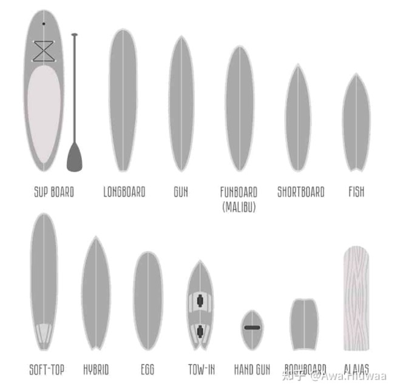

# 冲浪板选购指南

## ShortBoard衝浪板推薦參數體重

| 体重        | 长度      | 宽度      | 厚度     |
| ----------- | --------- | --------- | -------- |
| 45.4 ~ 63.5 | 6′0″-6′4″ | 18½″-19″  | 2¼“-2¾ ” |
| 63.5 ~ 72.6 | 6′2″-6′6″ | 18¾“-19¼” | 2¾“-2½”  |
| 72.6 ~ 81.6 | 6′4″-6′8″ | 19″-19¾″  | 2½“-2¾”  |
| 81.6 ~ 90.7 | 6′8″-7′2″ | 19½″-20½″ | 2¾“-3”   |
| 90.7以上    | 7′2″以上  | 20″-21½″  | 3″-3¼″   |

## **FunBoard衝浪板推薦參數**

| 体重        | 长度      | 宽度      | 厚度     |
| ----------- | --------- | --------- | -------- |
| 45.4 ~ 63.5 | 6′8″-7′2″ | 20½“-21¼”  | 2¼“-2¾ ” |
| 63.5 ~ 72.6 | 6′10“-7′4″ | 20¾“-21½” | 2¾“-2½”  |
| 72.6 ~ 81.6 | 7′2″-7′8″ | 21″-21¾″  | 2½“-2¾”  |
| 81.6 ~ 90.7 | 7′6″-8′0″ | 21½“-22¼” | 2¾“-3”   |
| 90.7以上    | 7′10″-8′4″  | 22″-22¾″  | 3″-3¼″   |

> 以上數據為長期衝浪者選擇推薦，假如您衝浪頻率少於一周一次，建議在此基礎上長度增加2”，寬度和厚度增加¼“

