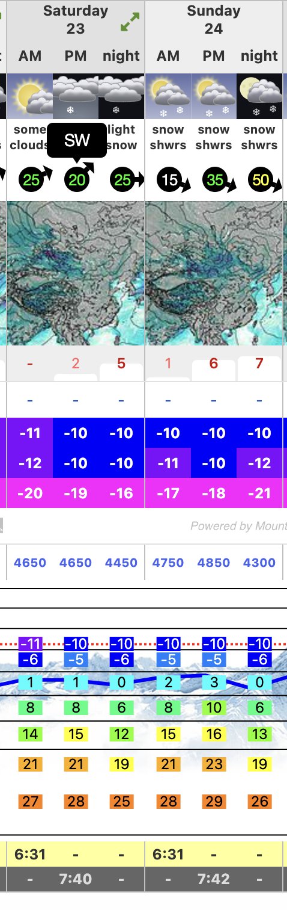

# 巴郎山垭口滑雪计划

大山是每一个滑雪者的最终目标

趁着川西春雪还在，冲！

计划时间：04.23 ～ 04.24

当时天气：

​			小雪，应该有云海，能见度一般，雪质好。

积雪深度：100 + 18 ～= 120cm左右

雪层判断：底部是糖霜雪，有雪崩风险

## 行程计划

周五晚上从成都开车到卧龙，当天在卧龙休息。

23号一大早从卧龙开车去垭口顶部（1个半小时左右），爽滑到垭口四姑娘山方向垭口底，随后车接回垭口顶。

晚上回卧龙镇子睡一晚。

24号一大早重复23号爽滑，晚上看情况开回成都或者继续住卧龙。

## 行程内容

23号：

- 挖雪层测试+初级雪崩知识科普
- AT装备科普
- 爽滑
- 拍摄照片

24号：

- 爽滑
- 无人机拍摄视频

上升&滑行轨迹借鉴：

## 装备

> 请购买高山滑雪保险

滑雪装备：野雪板、雪鞋、雪服、头盔、雪镜 etc.

通讯装备：对讲机

**如果需要上升请携带AT装备!!!**

