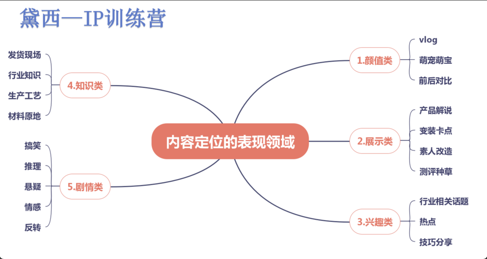
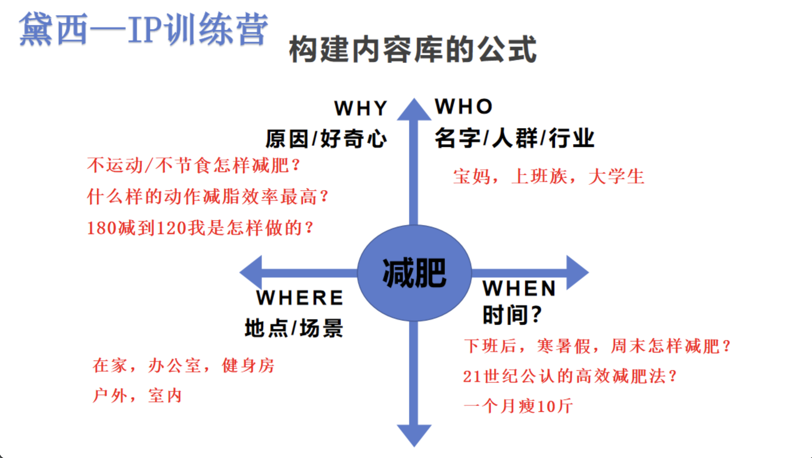
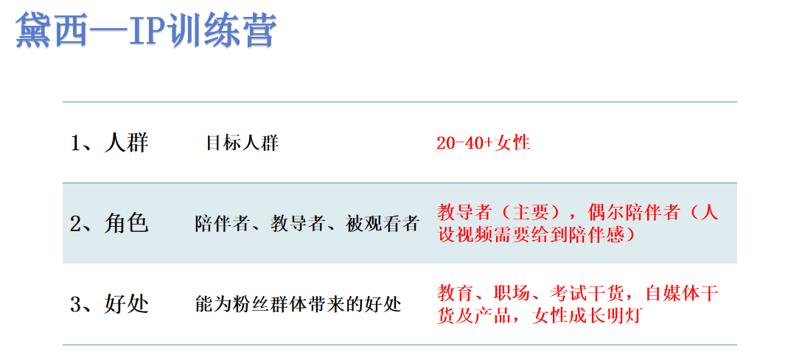
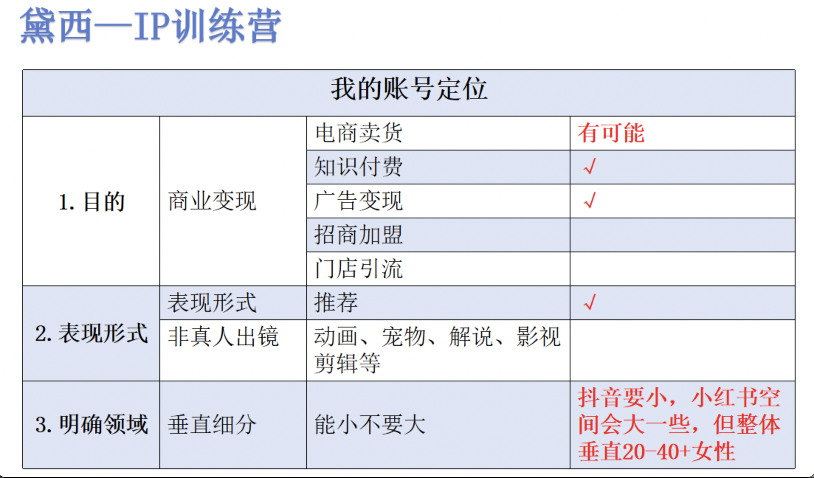
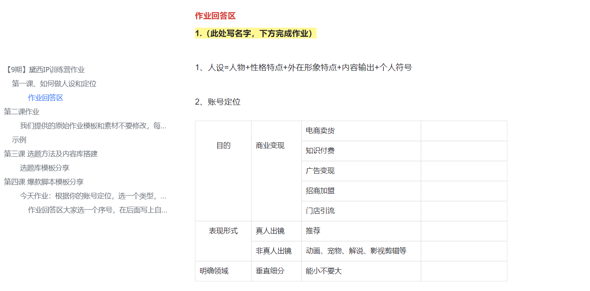

# Self Definition

定位: 户外类知识型博主

人设：互联网农民工放弃高薪内卷的工作，选择了自然和户外

阿鹤 = 24岁freelancer/前程序员（入过500强外企）+ 理性/逻辑思维强+180cm/六块腹肌/高瘦/长发/黑皮+户外运动场景/登山经历/小白入门/个人成长故事+长发/纯色T/固定开场白口头禅

魔都妈妈黛西（干货传递）=30岁职场女性/宝妈+理性/逻辑思维能力强+OL/知性穿搭/固定饰品+教育/职场/个人成长干货+固定镜头场景/发型

人设=人物+性格特点+外在形象特点+内容输出+个人符号 

内容：辞职后的生活(娱乐/personal)、运动入门tutorial（知识）

变现产品：向导、户外品牌合作、私域带货、开课+收徒

知识付费？

链路关？

搞定定位、内容、产品、链路四个关卡

## 人设

人设=人物+性格特点+外在形象特点+内容输出+个人符号

先问大家3个问题： 
1、你是否把自媒体当朋友圈发，想到啥发啥，视频完全没流量？ 
2、跟拍热点视频，点赞很多却涨粉很少？ 
3、账号有一些粉丝，但是很难变现，没广告，完全不知道怎么赚钱？

    人们关注一个账号的原因一般有3点：
    
        1、你这个人长得美、跳得好、唱得好、讲得好，我喜欢你所以关注你； 
    
        2、你发的垂直内容是我感兴趣的方向，比如美妆、知识、教育、育儿干货，我想多学习多了解； 
    
        3、你人为引导了关注，比如抖音里的“赶紧帮我点赞”，但切记，小红书严格限制引导赞藏评和关注，如果你口播里或者文案里有相关内容，会系统检测到，会被限流；

总结起来就是：强内容、强人设、强提醒 

常见的人设包括：个性输出、技能展示、干货传递 
个性输出：变装、搞笑、某些剧情类 
典型案例：小橙子，我是田姥姥 

1、人物，是人设打造的关键因素，除颜值博主，其他和长相没有太大关系，但和表现力有非常大的关系。人物就是你的基础设定，比如：我是一个上海工作生活的宝妈，有着丰富的人生经历，做过老师、创过业，进过大厂，考过研。你可以理解为，人物，是你真实人生的提纯。 
> 我是生活在澳洲的中国妈妈，悉尼大学金融硕士，进过银行，正在创业，从当妈妈的第一天起，就用理性思维对比测评母婴好物，乐于将买买买的经验分享给大家。 

2、性格特点：高冷、软萌，各种类型都可以。但切记，一定要统一，如果前后差异过大，就会有“包装、幻想破灭、不能接受”的感觉 
理性、干货、逻辑性的标签，我才知道大家最喜欢我这一面，生活中我也有情绪化的一面，但这不会是我自媒体的主流。 

3、外在形象：和内容，人设相辅相成。思考一下：母婴账号穿得正装笔挺合理吗？老师类账号穿的夸张暴露合理吗？ 
合理、良好的视觉形象，是点开封面，看完视频的重要加持。

4、内容输出：需要确定标签+内容底层逻辑。标签就是你在机器识别世界里的通行证，一个被打上母婴类目的标签的账号，是不太可能出现在男人或者老人的手机里的 

机器对账号的识别是多维度的：名字、主页、内容、粉丝、评论、互动，等等。甚至最近抖音和小红书都推出了主动打标签的功能，也就是你直接告诉机器，你要走哪个赛道，提高机器识别效率。

5、个人符号： 
鹤老师的蓝帽子 

内容表现形式需要明确两个最基础的点：1、表现形式 2、表现领域

当你不知道该出什么内容的时候

账号定位和人设定位是树根和树干的关系，账号定位是最基础的，如果你定位不准确，没想明白怎么变现，什么火你拍什么，后果就是涨粉了不赚钱。

人设定位就是树干，通过恰当的人设定位帮助我们去结出赚钱的胜利果实。

推荐真人出镜

## Next Step

找对标账号：类似的定位的博主有谁，他们的内容怎么分布的，最火的内容是什么

