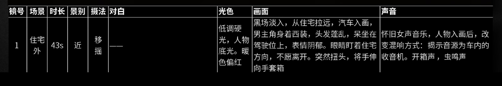

## 01

如果艺术具有表意性和想象性这两个特征，那么艺术必然是语言。

《艺术原理》—罗宾.乔治.科林伍德

电影艺术语言是视听语言，视听语言分为三部分：镜头运用、画面剪辑、声画组合。

视听语言具有逼真性和幻觉性

一、逼真性：需要在对明暗、色彩、声音等元素精准把握，需要向观众传达具体准确的对现实逼真的呈现；

二、幻觉性：运动幻觉和立体幻觉

1.运动幻觉
当外界刺激停止作用后，还能暂时保留一段时间的感觉（视觉后像）
原来没有在空间中发生位移的物体，被感知为运动的现象（似动现象）
比如两个光点在交叉闪烁，被感知为单个点在两个位置之间来回运动
2.立体幻觉
二维空间变三维空间是根据日常生活经验进行的心理补偿
比如近大远小产生的透视、物体遮挡产生的前后层次、空气散射产生的深度层次、运动物体产生的运动视差等等。
总结：
1.画面细节的把握；立体声、环绕立体声通过声音塑造的空间幻觉都能更好让观众代入剧情。
2.视听语言引发人最基本的生理和心理感受。
3.比如通过镜头的景别暗示心理的距离；通过镜头的角度暗示人物的地位；剪辑利用蒙太奇的技巧组接镜头暗示更为深刻的含义。

## 02

视听语言基本元素：
镜头、机位、画框、构图、景别、角度、运镜、光线、色彩、景深、场面调度
视觉元素
一、镜头（个角度看待）
物理角度；感光元件将现实世界记录下来
拍摄角度；从开机到关机拍摄的画面（原始素材）
摄影师角度；分镜头脚本和故事板
剪辑角度；两个剪辑点之间的一段画面
观众角度；两个剪辑点之间的一段画面（成片）
二、机位
摄影机的位置，场景中摄影机位置的路径为机位图
三、画框：影像的边缘
四、构图：在画框之内，画面的结构和布局
五、景别：被摄主体在画面中的大小，画面范围
六、角度：摄影机和被摄物之间连线的夹角
七、运镜：摄影机的运动，包括摄影机的位置、角度和焦距的变化
八、光线：拍摄场景中的光效，画面的明暗布局
九、色彩：画面中色彩的表现
十、景深：摄影机焦点前后的范围内所呈现清晰图像的距离
十一、场面调度：拍摄现场的演员、摄影机、灯光、服装、道具、布景等综合安排
听觉元素
一、人声：对话、旁白、独白
二、音乐
三、音响：除人声、音乐之外的听觉音效
视听语言组合
剪辑：镜头之间画面之间组接方式

分析视听语言
一、分镜头分析
有助于我们理解镜头之内的场面调度和镜头之间的剪辑关系，从局部到整体的各个层面分析
分镜头分析包括：镜头号—场景—时长—摄影方法—对白—光色—画面—声音
二、机位图分析
画出某个场景的机位图，便于观察机位的选择和多机位配合，有助于掌握镜头语言内在的规律。
三、影片背景分析
导演背景（个人经历、价值取舍、审美趣味、行事风格）
时代背景（技术条件制约、时代烙印、历史背景、人性规律）
总结：
通过各个视听元素选择、组合、排列与配合，让众多元素共同演绎一场视听盛宴。

## 03

画框：对真实空间进行取舍，捕捉其中最富有审美价值的一部分内容并展现出来。
观众看待真实世界的视觉习惯：
画框上方是天空；下方是地面；一般人物的入画出画主要发生在画左画右。
画框分为：画内空间和画外空间
一、画内空间：
1、用画框将画外画内隔绝之间的联系，将画面空间营造一个封闭的世界。
2、去暗示、隐喻人物的心理或生存状态。
二、画外空间：
需要与画内空间和画外空间联系起来，让观众产生对画外空间的想象，完成叙事与表现。
1.出画/入画（人物进入房间、跳出窗外、走到取景框之外等等）
2.视线/动作（击打、射击、对话、眼神交流等等）
3.投影/光线（产生悬疑感、画外光线引导）
4.画外局部（身体或常见物品局部出现画内，观众也会对其完成是一个整体的想象）
5.反射物（利用镜子、玻璃、金属等反射物映出画外的人和物）
6.打破隔断（通过人物调度游走与半开放的空间中如门、窗户，跟随人物想象到画外空间）
7.运镜（随着摄影机的运动揭示更多的画外空间）
8.画外音（画外空间的音效、音乐、对话、音响）
总结：
一个框定（画面选取）经过艺术取舍的画面更符合人们观察世界的习惯，能告诉观众要看哪。

## 04

构图：安排好各个被摄元素的联结关系和组合结构；突出主体；表现视觉美感表达主题；
传递导演个人风格和情感。
被摄元素：人、物、线条、形状、光影、色彩等各种造型元素
一、主体（画面主要表现对象，是内容中心也是结构中心，其他元素围绕主体形成一个整体）
二、陪体（与主体联系紧密并一同构成特定情节的对象，起烘托、渲染主体的作用）
三、环境
1.前景（位于主体之前更靠近镜头的人和物）
2.背景（处在主体之后的人和物）
环境的作用
1.增加层次感（前景、主体、后景之间的遮挡，通过视觉补偿机制产生空间幻觉）
2.交代环境（点眀主体的年代特征、地域特征、自然环境）
3.刻画人物、性格（暗示主体的身份、职业、性格、爱好等等）
4.暗示主题（与主体形成象征、对比、隐喻的关系）
5.增加速度感（快速掠过的前景或背景）
突出主体
1.主体面积大（主体比非主体的面积都要大）
2.控制影调、色调（非主体不宜太鲜明）
3.非主体适当虚化
4.不同的运动方式（静衬动、动衬静、方向不同）
5.非主体避开中心（几何中心、视觉中心）
总结：
明确主体

突出主体的构图分为：几何中心、视觉中心、画面边缘
一、几何中心（幅面对角线的焦点；画面的中心；由于它的端正容易形成对称结构。可以暗示庄重、威严的气氛）
二、视觉中心（三等分线或黄金分割线交叉的四点）
三、画面边缘
1.主体在画面的画左画右边。可以暗示人物被排挤、羞辱的状态
2.主体和陪体分置画面左右两边。可以强调二者之间的距离感、隔阂
3.主体大面积位于画面上方，通过仰拍。可以体现居高临下的权威感
4.主体位于画面下方，受到上方空间的压迫。暗示主体无助和脆弱
5.倾斜的地平线，会暗示不稳定的电影空间，一般情况下不宜倾斜
6.地平线会将画面分割成上下两个部分，避免让地平线穿过主体的头和脖子
7.地平线在画面上方三分之一时能增强画面的纵深感，有较好的视觉舒适
8.地平线在画面下方三分之一时能增强画面的广度，给人开阔、壮观的感觉
总结：
电影的构图不是目的而是手段，创作者通过构图暗示主体、表现主体，展示创作风格。
从画面表现拍摄对象的外在形式进而领悟其内在的品质，考虑情节发展阶段和各个元素之间的关系，创造性的安排传递画外之音

几何中心：电影画幅的中心，幅面对角线的焦点就是几何中心。位置不偏不倚，端正，易吸引观众的注意力，形成对称结构，暗示庄重无眼的气氛。

视觉中心：从视觉上来看，画面中三等分线或黄金分割线交叉的四个位置，更容易引起视觉的注意，因为画面中的这些位置，呈现在视觉中最为清晰。

相比几何中心，在视觉中心安排主体，不仅能吸引注意力，也更灵活方便，可以打破画面的死板，具有生动有趣的艺术效果，是很多影片中常用的安排主体的方法。

画面边缘：将主体放在画左画右的附近，主体像是要跌出画面，可以用来暗示人物被排挤屈辱的状态。如果将主体和陪体分置画面左右两边，还可以强调二者之间的距离感，暗示他们的隔阂。

上方和下方：当主体大面积的位于画面上方时，有一种居高临下的威严感。塑造英雄人物时，通过仰拍，可以强化主体的气势。相反位于画面下方的主体，会受到上方空间的压迫，暗示他们的无助和脆弱。

地平线：天地之间的分界线，在远景的画面中表现最为明显，而在近景镜头、俯仰镜头中常常会被淡化，倾斜的地平线会暗示不稳定的电影空间，所以一般情况下地平线不宜倾斜，另外地平线的存在，会把画面分割成上下两部分。构图时，避免让地平线穿过主体的头和脖子。安排地平线在上方1/3处时，能增强画面的纵深感，视觉感受上最为舒适；而安排在下方1/3处时，能增强画面的广度，给人开阔壮观的感觉。

电影的构图不是目的而是手段，创造者通过构图暗示主体，展现创作风格，让观众通过感受拍摄对象的外在形式，进而领悟其内在的品质。

## 05

视点分为：客观视点和主观视点、导演视点、视点综合运用
一、客观视点
与文学中的第三人称类似，是纪实性的摄取，是由隐形观察者的角度去看事件的起因元素、发展过程、结果，人物不参与摄影机的肢体眼神交流
1.机位高度，机位高度一般和人等高
2.标准镜头，镜头呈现的透视关系和目视接近（视场角50度、等效焦距40—60mm）
3.平视角度
4.视觉中心构图
二、主观视点
可以是主角的视角也可以是某人物的视点，用角色的视角描述场景、叙述故事，可以是看到的也可以是感受到的
三、导演视点
利用声音、色彩、造型、角度、景深、构图等视听语言告诉观众要看哪
四、视点综合运用
手持拍摄模拟主观视角；空间摇移模拟寻找状态；过肩镜头模拟人物视角表达被摄物之间的关系

借鉴文学中有第一人称与第三人称
第一人称：以人物主观视角经历事件“我”“我们”，便于表达作者自己的感情和观点，有亲切、真实的艺术效果，但局限于不能描写“我”活动范围之外的世界也不能叙述他人脑子里的想法。
第三人称：以客观的视角或上帝视角去经历事件，可以对事件、人物进行各方面的描绘，客观、直接把人物经历和事件发展展现在观众面前，有超越第一人称的广度和深度。
总结：
全片需要帮观众回答观影四大问题：
1.谁在看
2.在看什么
3.看到后的反应
4.他们之间的关系

## 06

机位：
在一个镜头开始时摄影机在真实空间的位置，根据分镜脚本安排不同的机位相互配合避免穿帮和后期剪辑修改空间。
1.定场镜头（交代画面发生地点时间，通常是开场画面）
2.主镜头（提供一场戏的全局概况，通常是全景）
3.插入镜头（介绍全局中的某些细部特征或强调情节的重点，通常是静物特写）
4.切出镜头（通过对比或隐喻暗示主题，表现回忆与转场等。通常用作蒙太奇手法）
5.双人镜头、单人镜头、三人镜头、群体镜头
（双人镜头中一个侧着或背对镜头，三人镜头中两个侧着或背对镜头，群体则要有远近对比）
6.过肩镜头（镜头越过一个人的肩膀进行拍摄，强调前景人物与所看事物之间的关系）
7.反打镜头（与前一个镜头的视线相反的镜头，反打机位夹角在60—120度之间,通常对话）
内反打比外反打（更贴近角色的主观视角）
好莱坞三镜头法（一个双人镜头接一组正反打镜头）
8.反应镜头（表现角色对某个声音、事件、动作的反应，通常使用正反打，面部或肢体语言）
总结：
安排好机位是进一步相关场面调度元素的前提，画出机位图是训练和培养机位意识的有效方法。绘制机位图可以用纸画可以使用(Shot Designer）软件，带着两个问题绘制机位：1、导演是出于何种目的去安排这个机位；2、达到这个目的是否有更好的安排手法呢？

